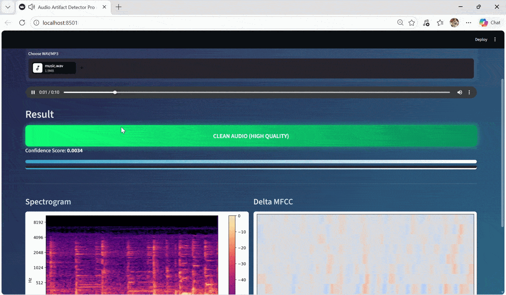

## Demo

<p align="center">
  
</p>

# Audio Artifact Detection

Deep Learning System for Detecting Compression Artifacts in Audio

---

##  Overview

This project presents a deep learning-based system for detecting compression artifacts in audio signals.

Unlike traditional audio classification tasks that aim to identify *what* a sound is, this system focuses on understanding *how* the audio has been processed, specifically identifying degradation introduced by lossy compression.

---

##  Key Idea

Instead of answering:

> "What is this sound?"

This system answers:

> "How has this sound been processed?"

---
## Description

This project presents a deep learning-based framework for detecting audio compression artifacts, with a focus on low-bitrate signals (8 kbps).

Unlike traditional audio classification tasks, this system focuses on analyzing how audio is encoded and identifying degradation patterns introduced by compression.

The model utilizes a 3-channel feature representation (MFCC, Delta, Delta-Delta) combined with a Convolutional Neural Network (CNN) to distinguish between clean and compressed audio.

---

## Methodology

### Feature Representation

Each audio signal is transformed into a 3-channel feature tensor:

- MFCC (Mel-Frequency Cepstral Coefficients)
- Delta (First-order derivative)
- Delta-Delta (Second-order derivative)

This representation captures both:

- Spectral characteristics (frequency content)
- Temporal dynamics (changes over time)

---

### Model Architecture

```text id="arch_block"
Input (3 × 13 × T)
    ↓
Convolution Layers (Conv2D + BatchNorm + ReLU)
    ↓
Temporal Pooling
    ↓
Fully Connected Layer
    ↓
Softmax Output (Artifact Probability)
```

---

## Dataset

The dataset is constructed from ESC-50 (Environmental Sound Dataset) with selected categories to ensure diversity in signal characteristics.

### Data Preparation

To train the model for artifact detection, clean audio signals are processed to simulate lossy compression effects.

Each audio sample is converted into compressed versions using standard encoding techniques.

The goal is **not to classify bitrate**, but to expose the model to perceptual degradation patterns such as:

- Loss of high-frequency components  
- Temporal smearing  
- Quantization noise  

These characteristics are typical of compressed audio signals.

The model therefore learns to detect **signal degradation patterns**, rather than relying on explicit compression parameters.

---

## System Pipeline

```text id="pipeline_block"
Raw Audio
    ↓
Preprocessing
    ↓
Feature Extraction (MFCC + Delta + Delta2)
    ↓
Model Inference (CNN)
    ↓
Visualization & Analysis (Streamlit)

---

##  System Features

- Upload or record audio input  
- Real-time artifact detection  
- Artifact probability score  
- Spectrogram visualization  
- Temporal artifact highlighting  
- Multi-channel feature visualization (MFCC, Delta, Delta-Delta)

---

## Repository Structure

```text id="repo_block"
Audio-Artifact-Detection/
│
├── Audio-app/
│   ├── app.py
    ├── demo.gif
│   ├── models/
│   │     └── model.pth
│
├── src/
│   ├── train.py
│   ├── preprocess.py
│   ├── extract_mfcc.py
│   ├── build_dataset.py
│
├── features/
├── compress.py
├── requirements.txt
├── README.md
```

---

## Installation

Clone the repository:

```bash id="clone_block"
git clone https://github.com/thaiidduong/Audio-Artifact-Detection.git
cd Audio-Artifact-Detection
```

Install dependencies:

```bash id="install_block"
pip install -r requirements.txt
```

---

## Usage

Run the application:

```bash id="run_block"
cd Audio-app
streamlit run app.py
```

---

## Training Pipeline

```bash id="train_block"
python src/extract_mfcc.py
python src/build_dataset.py
python src/train.py
```

---

## Results

The model is optimized for detecting artifacts introduced by aggressive compression (8 kbps).

The output includes:

* Binary classification (Clean / Compressed)
* Artifact Confidence Score
* Spectrogram visualization
* Temporal artifact highlighting

---

## Discussion

This project shifts focus from traditional sound classification toward signal quality analysis.

Instead of answering:

"What is this sound?"

It answers:

"How has this sound been processed?"

---

## Technologies

- Python (core programming language)
- PyTorch (deep learning framework)
- Librosa (audio feature extraction)
- SciPy (signal processing)
- NumPy (numerical computation)
- Pandas (data handling)
- Matplotlib & Seaborn (visualization)
- Plotly (interactive visualization)
- SoundFile & Pydub (audio processing)
- FFmpeg (audio encoding/decoding)
- Streamlit (web-based deployment)

---

## Author

Nguyễn Anh Thái Dương
Hanoi University of Science and Technology (HUST)
Multimedia Communications
